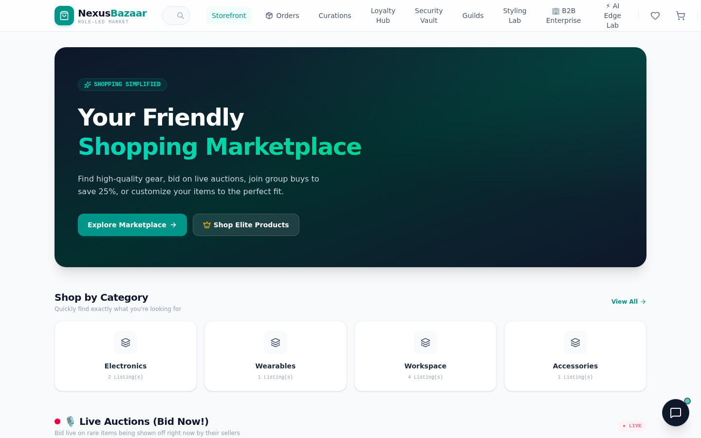
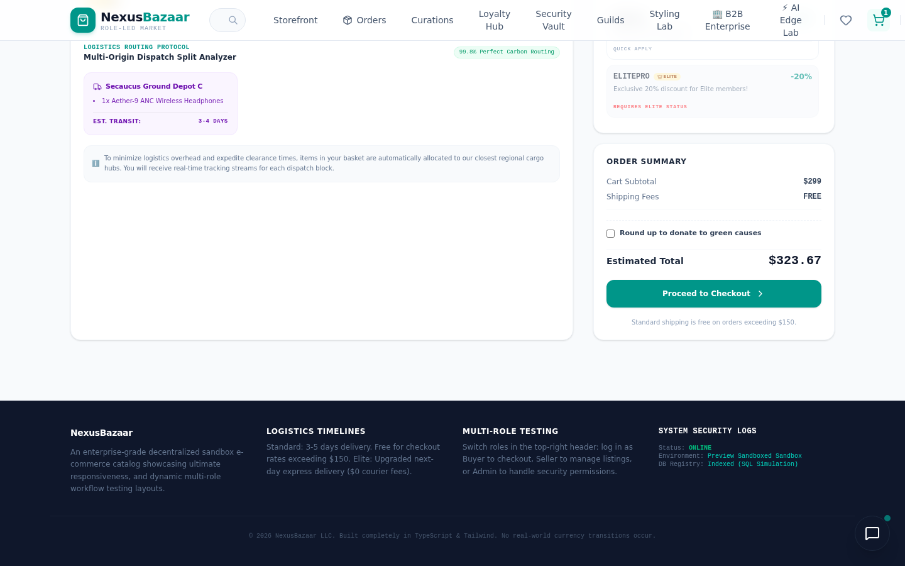
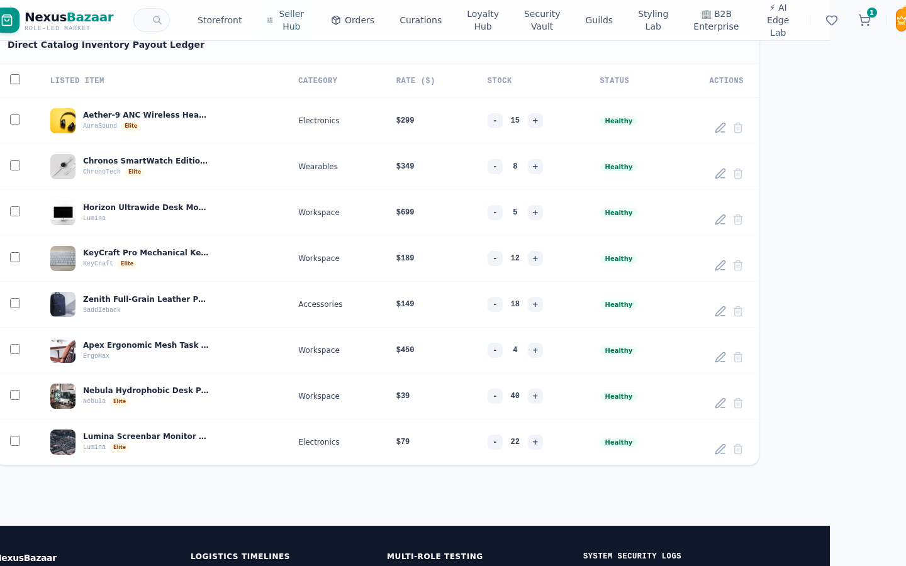
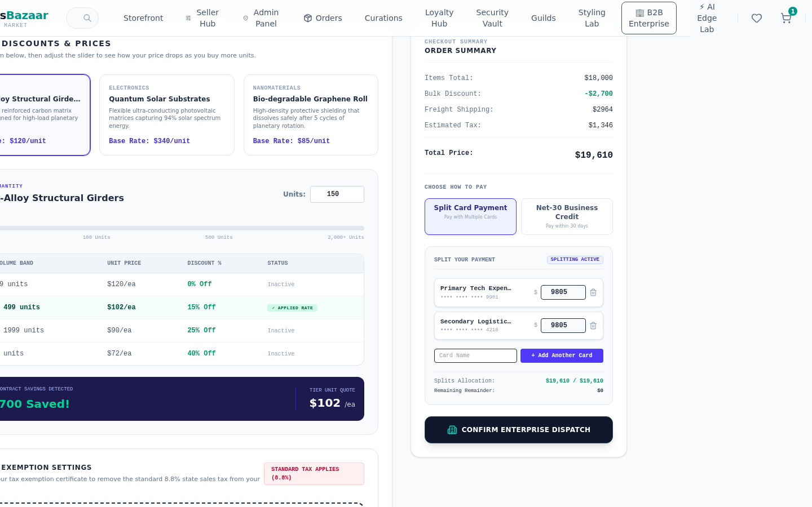

# NexusBazaar

Client-side multi-role marketplace for buyers, sellers, and admins — storefront, promo checkout, B2B RFQ, and localStorage persistence.

[](https://nexusbazaar-market.vercel.app)
[](https://github.com/devtechedge/nexus-bazaar/actions/workflows/ci.yml)
[](https://react.dev/)
[](https://vitejs.dev/)
[](https://www.typescriptlang.org/)
[](https://tailwindcss.com/)
[](LICENSE)

---

## Live Demo

**https://nexusbazaar-market.vercel.app**

> **Status:** Public deploy is a **client-side demo**. Catalog, cart, orders, loyalty, and B2B ledgers persist in `localStorage`. There is no production payment backend, JWT, or NextAuth. Switch Buyer / Seller / Admin from the header avatar. `NEXUS10` is a public promo; `ELITEPRO` needs Elite (crown toggle). NexusBot falls back to a mock reply unless `GEMINI_API_KEY` is set locally.

Do **not** use [nexus-bazaar.vercel.app](https://nexus-bazaar.vercel.app) — that hostname is a different lifestyle-blog project.

This is the **only** public repo for the marketplace.

---

## Screenshots

| Storefront | Cart |
|------------|------|
|  |  |

| Seller hub | B2B wholesale |
|------------|---------------|
|  |  |

---

## Features

- Buyer storefront with search, product details, wishlist, live-auction tiles, and promo checkout (`NEXUS10`, `ELITEPRO`, `BIGSAVER`)
- Header identity switcher for Buyer, Seller, and Admin — seller/admin chrome is role-gated
- Seller hub: listings, inventory, vouchers, broadcast tiles
- Admin workspace: user flags, promo ledger, marketplace metrics
- B2B desk: RFQ, Net-30 credit, team budget, pallet calculator
- Loyalty, guilds, curations, security-vault UI — all `localStorage`
- Optional Gemini concierge at `POST /api/gemini/chat` (mock without a key)

---

## Tech Stack

| Layer | Technology |
|-------|------------|
| Frontend | React 19, Vite 8, TypeScript, Tailwind 4 |
| Data | Seeded in-memory catalog + `localStorage` (not a SQL backend) |
| Auth | Demo role switcher — not JWT, not NextAuth |
| Payments | Simulated checkout only |
| AI | Optional `POST /api/gemini/chat` — mock fallback on Vercel |
| Hosting | Vercel (static Vite + `/api` function) |
| CI | GitHub Actions — Vitest, `tsc`, Playwright |

---

## Quick Start

```bash
git clone https://github.com/devtechedge/nexus-bazaar.git
cd nexus-bazaar
npm install
npm run dev
```

Open **http://localhost:3000**. Gemini is optional.

```bash
npm test
npm run typecheck
npx playwright install chromium
npm run test:e2e
```

---

## Demo notes

| Identity | How |
|----------|-----|
| Eager Buyer | Default. Cart, wishlist, orders, loyalty. |
| Elite Tech Seller | Header avatar → Seller Hub |
| Platform Admin | Header avatar → Admin Panel |

Promo codes: `NEXUS10` (10%), `ELITEPRO` (20%, Elite only), `BIGSAVER` (15% over $200).

---

## License

MIT. See [LICENSE](LICENSE).
